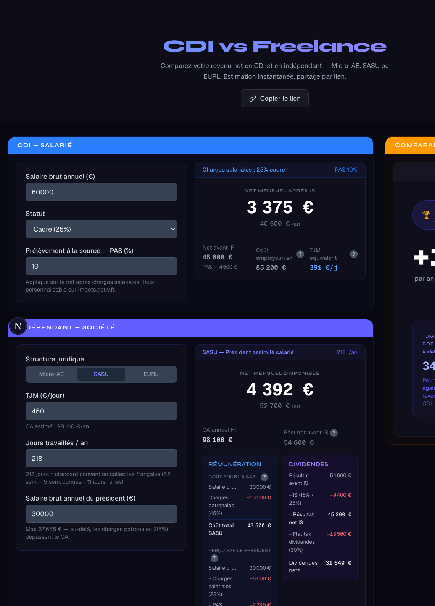

# CDI vs Freelance Simulator

A client-side financial calculator that helps French workers compare a **CDI (permanent employment)** against three freelance structures: **Micro-Entrepreneur (AE)**, **SASU**, and **EURL**.

All calculations run entirely in the browser — no backend, no data sent anywhere.



## What it does

Enter your gross salary (CDI) and your daily rate (TJM), and the simulator computes:

- **Net income after tax** for each structure
- **Employer cost** and break-even TJM for CDI
- **Social contributions, IS (corporate tax), and dividends** for SASU and EURL
- **A side-by-side comparison** with the financial gap between CDI and freelance

Results are shareable via URL — all inputs are serialized as query parameters.

## Supported structures

| Structure | Description |
|-----------|-------------|
| **CDI** | Permanent salaried employee (cadre or non-cadre) |
| **Micro-Entrepreneur (AE)** | Simplified freelance regime with flat contribution rate |
| **SASU** | Single-person simplified joint-stock company — president salary + dividends |
| **EURL** | Single-person limited liability company — TNS remuneration + dividends |

## Tech stack

- **Next.js 16** (App Router) + **React 19**
- **TypeScript** (strict mode)
- **Tailwind CSS v4**
- No external UI libraries, no backend, no database

## Getting started

### Prerequisites

- Node.js 18+
- npm

### Install & run

```bash
# Clone the repo
git clone https://github.com/MickBourgois/cdi-vs-micro-sasu-eurl.git
cd cdi-vs-micro-sasu-eurl

# Install dependencies
npm install

# Start the dev server
npm run dev
```

Open [http://localhost:3000](http://localhost:3000) in your browser.

### Other commands

```bash
npm run build    # Production build
npm run lint     # ESLint
npx tsc --noEmit # TypeScript type check (no build output)
```

## Project structure

```
src/
├── app/
│   ├── page.tsx              # Server component entry point
│   └── globals.css           # Tailwind v4 + CSS variables
├── components/
│   ├── HomeContent.tsx       # Main client component — owns all state & URL sync
│   ├── CdiResultCard.tsx     # CDI results display
│   ├── FreelanceResultCard.tsx
│   ├── ComparisonPanel.tsx
│   ├── CdiForm.tsx
│   ├── FreelanceForm.tsx
│   ├── DarkModeToggle.tsx
│   └── Tooltip.tsx
├── lib/
│   └── calculations.ts       # All financial logic (pure functions)
└── types/
    └── index.ts              # TypeScript interfaces and discriminated unions
```

## Key financial constants (French law)

| Parameter | Value |
|-----------|-------|
| CDI employee contributions (cadre) | 25% |
| CDI employee contributions (non-cadre) | 22% |
| CDI employer cost multiplier | ×1.42 |
| AE flat rate (social + CFP + IR libératoire) | 28.56% |
| SASU president salary cap | CA ÷ 1.45 |
| Flat tax on dividends (PFU) | 30% |
| IS rate (profit ≤ 42 500 €) | 15% |
| IS rate (profit > 42 500 €) | 25% |
| Default working days/year | 218 |

## License

MIT
